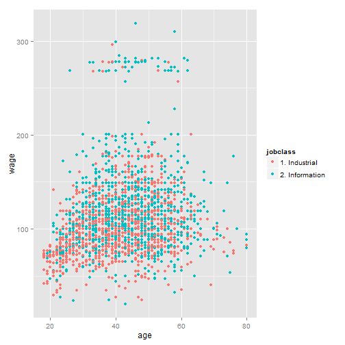

Wage Predictor WebApplication
========================================================
author: C. Obed Otto
date: 25-07-2015

Introduction

The purpose of the shiny application is to predict the wage of a employee.
It ask the name of the person, age, education, year, etc from the user. User input is given to the predictor and the predictor output is displayed at the right bottom of the webpage.

Wage Data Background
========================================================
I have taken wage data present in the ISLR library. Loading of data is done as follows.

```r
library(shiny)
library(ISLR);
library(ggplot2);
library(caret);
library(kernlab);
library(gbm);
set.seed(2500)
data(Wage)
names(Wage)
```

```
 [1] "year"       "age"        "sex"        "maritl"     "race"      
 [6] "education"  "region"     "jobclass"   "health"     "health_ins"
[11] "logwage"    "wage"      
```

Preparing the data for training
========================================================
Unwanted and irrelavent information is removed, and the required columns are selected for training the model.

```r
WageNew<-Wage[,c("year","age","maritl","race","education","jobclass","health","health_ins","wage")]
```
Data is divided into training and test set.

```r
inTrain<-createDataPartition(y=WageNew$wage,p=0.7,list=FALSE)
training<-WageNew[inTrain,];
testing<-WageNew[-inTrain,];
```
Training the predictor
======================================================
Prediction model is created using generalized boosted regression models.

```r
wageModel<-train(wage~.,data=training,method="gbm");
```
Wage distribution

```r
qplot(age,wage,color=jobclass,data=training)
```

 

Shiny App Implementation
=======================================================
Shiny UI is implemented using textbox, select,slider and radio button controls.
When ever any change in the UI value, data is passed to the server and the prediction is done in the server and the out put is displayed in the right bottom side of the webpage.

server.R is implemented as follows

```r
shinyServer(
  function(input,output){
    output$wagedistribution<-renderPlot({
      qplot(age,wage,color=jobclass,data=training)
    })
    output$weltext<-reactive({paste('Hi ',input$pre_name,',')})
      
    output$predictedWage<-reactive({paste('Your estimated salary is $',predict(wageModel,data.frame("year"=input$pre_year,"age"=input$pre_age,"maritl"=input$pre_maritl,"race"=input$pre_race,"education"=input$pre_education,"jobclass"=input$pre_jobclass,"health"=input$pre_health,"health_ins"=input$pre_healthins)),' per day.')})    
  }
)
```
